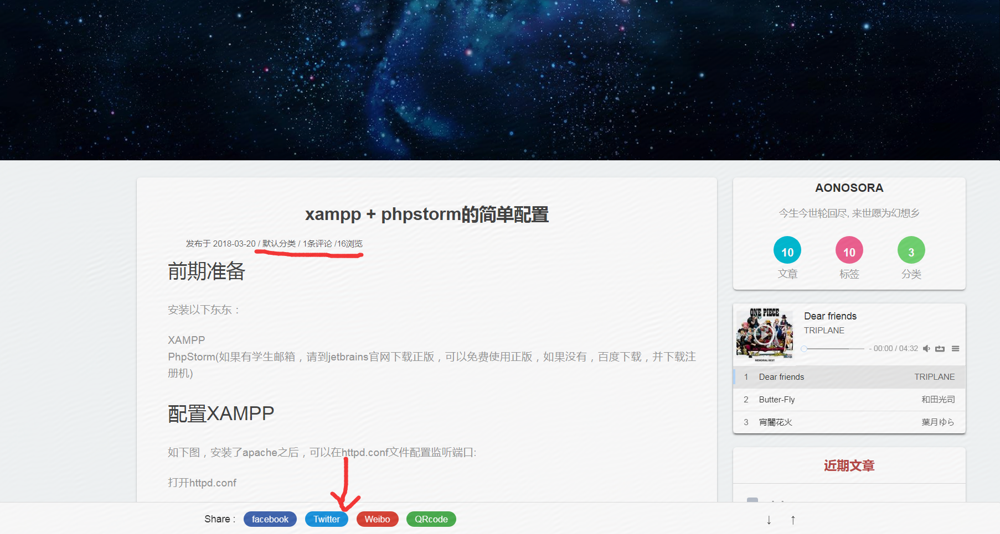
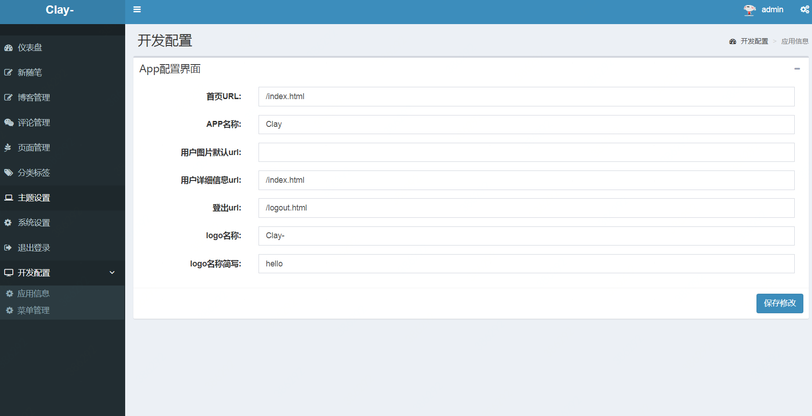

#### 本博客还在开发完善中同时也是作者的一个学习项目 各位只能当做学习项目 目前不要搭建到服务器上

交流群：951459325 欢迎交流学习

## 最近更新
登陆后台地址改为  /admin/login.html
- vue-admintle jar包需要更新 maven clean 后重新编译打包

- 增加了themleaf模板 
- 代码优化重构 升级到springboot2.5
- 增加了备份的功能
- 增加了上传文件
- 有table展示的页面做了优化 SQL做了优化
## 基本技术

环境: `Springboot+mysql+admintle+vue.js+mybatis`环境搭建的个博客
- springboot2.5
- logback 日志
- mybatis框架
- vue.js框架
- mysql数据库
- theamleaf模板
- admintle 后台页面
- editor.md 开源markdown编辑器
- springmvc框架


## 注意的是
- 前后端的区别
前端是通过模板的查找 默认资源路径是tempaltes 可自定义路径
后端是静态 是直接访问资源的 默认资源路径是static 不可重定向
### 搭建方法在下面


后台菜单自主配置需要在 vmOptions中添加:-Dadmin.src.dir=D:\code\ssmBlog  
dir后面是你的项目路径
## 前台首页

## 首页右边分类浏览

## 文章预览 访问量和评论 分享



## 后台登录界面
 

## 后台首页


### 博客列表显示


### 博客编辑器 采用开源的editor.md

## 后台评论管理页面


### 页面管理 标签管理

## 后台配置管理
### 配置页面信息

### 添加菜单和子菜单


### 本地搭建 
运行成功后访问:http://localhost:8002
后台是http://localhost:8002/login1.html
1. 使用IDEA编辑器 打开文件中pom.xml文件
2. 引入本地jar包依赖
maven运行编辑 
方法一
在编辑器按 `alt+12` 打开终端 输入下面命令  记得路径要改为自己工程里面vue-adminlte4j-1.0.1-SNAPSHOT.jar文件包的路径
```
mvn install:install-file -Dfile=D:\code\blog\ssmBlog\src\vuejar\vue-adminlte4j-1.0.1-SNAPSHOT.jar -DgroupId=com.vue.adminlte4j -DartifactId=vue-adminlte4j  -Dversion=1.0.1-SNAPSHOT -Dpackaging=jar
```
然后依次按下图点击 clean 清除原先的包 编译导入包 安装依赖到工程中

方法2 其实就是引入该jar包原工程
安装辅助工程
https://github.com/Arsense/vue-adminlte4j
安装过程见其README
运行test 下面ApplicationStarter 访问地址 http://localhost:8080/index.html
有页面即为安装成功,然后用maven工具打包安装到本地

pom.xml引入:
	<dependency>
			<groupId>com.vue.adminlte4j</groupId>
			<artifactId>vue-adminlte4j</artifactId>
			<version>1.0.2-SNAPSHOT</version>
	</dependency>

3. 运行 在自己mysql服务上创建名为`ssmBlog`数据库
4. 把下图sql语句在`ssmBlog`中运行 自动生成数据和表
5. 在 application.yml文件中 更改自己的数据库密码和用户名
6. 点击下图Applcation类运行  访问 `http://localhost:8002 `即可
端口配置在 application.yml文件中 
7.后台路径 加 "login1.html"


项目maven package打包成war包 放到相应tomcat工作目录 运行tomcat
### 默认账号名密码都是 admin admin  路劲是login1/html 如果想使用请数据库直接修改
目前还没增加此功能


